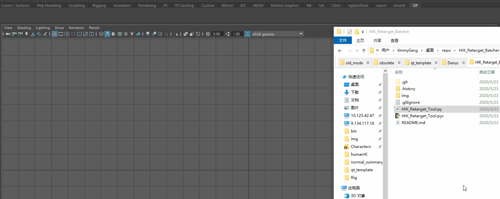
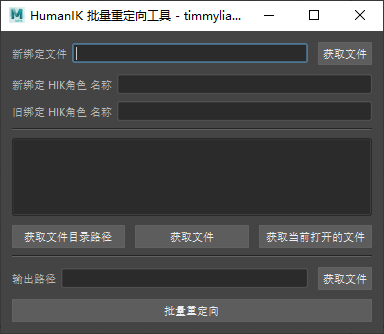
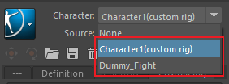
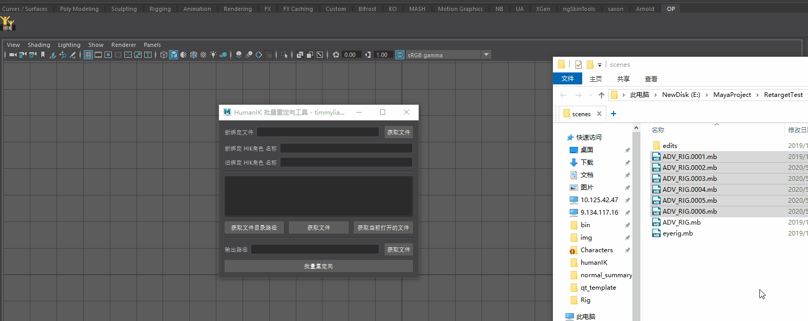

# HIK_Retarget_Batcher

HumanIK 批量重定向工具 | 支持 Maya2016+

## 安装

+ 拖拽脚本到 Maya 的视窗即可完成安装

## 使用方法

> 这个重定向工具是用来应付出现两套不同的绑定使用同一套动画的情况。
> 新绑定文件指代新的用来替换的源绑定文件 

> HIK角色是指需要 HumanIK 定义的角色化节点名称

> 如何实现角色化参考我写的[文章](https://blog.l0v0.com/posts/79818906.html)

---

> 中间选择用于重定向的动画文件，中间的列表组件可以直接拖拽 Maya 文件进去
> 也可以根据按钮添加相应的 Maya 文件

---

> 最后添加输出的路径，自动重定向会将 Maya 文件另存到输出路径上。
> 由于重定向之后还需要进一步的调整匹配，所以没有直接导出 FBX ，而且导出 FBX 还要根据相关流程的规范进行处理才行。

